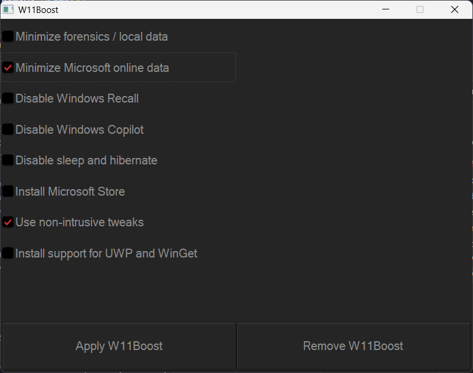

#  W11Boost

A sizable customization suite for Windows 10 and 11 that can also repair your system in terms of tweaks (not file corruption), and is small enough to be distributed via Discord or other social media platforms.

W11Boost automatically makes a system restore point if for any reason it's unsatisfactory; this works even if system restore points are disabled.

W11Boost's logo is attributed to [Monkik](https://www.flaticon.com/authors/monkik).

## Table of Contents

- [How to use](#how-to-use)
- [Additional recommendations](#additional-recommendations)
    - [Windows](#windows)
    - [Backups](#backups)
    - [GPU](#gpu)
    - [BIOS](#bios)
    - [Ethernet](#ethernet)

## How to use

All versions of Windows 11 except Insider builds are supported.

1. Go to the [latest releases](https://github.com/felikcat/W11Boost/releases) to download W11Boost; to verify if it's authentic, the serial number for the self-signed certificate should always be `165da71ed1c166b344ff03d7f08e7fa9`.

2. Run W11Boost in a virtual machine first to verify functionality, and get a feel for what changes you want to make.

    - There are default changes that some people won't want, such as preventing as much connections to Microsoft as much as possible; that includes any form of cloud syncing / convienence features that sacrifice your privacy and add some weight to your system.

Before W11Boost:  

After W11Boost (default settings):  

## Additional recommendations

### Windows

> **Note:** Third-party anti-malware programs can provide better protection, but can seriously screw up your Windows installation, as Kaspersky would even after uninstalling it.

1. Install the following: 

    - If you have an AMD CPU, grab the [latest chipset drivers](https://www.amd.com/en/support/download/drivers.html) for it.
        - For Intel CPUs, [go here](https://www.intel.com/content/www/us/en/support/articles/000005533/software/chipset-software.html).

    - [CPU Set Setter](https://github.com/SimonvBez/CPUSetSetter). For a Ryzen 7 9800X3D, I disable core 0 to improve the FPS and stability of games:  
    

2. Replace Consumer OEM apps with their Enterprise variant. Such as replacing Lenovo Vantage with Lenovo Commercial Vantage.

3. Keep the number of apps installed to a minimum, and remove unused apps. This reduces your chances of being impacted by [supply chain attacks](https://www.bleepingcomputer.com/news/security/hackers-compromise-3cx-desktop-app-in-a-supply-chain-attack/), prevents causing Windows more issues, and might improve FPS stability.

### Backups

Use [Veeam Agent](https://www.veeam.com/send_license/backup-agent-windows-free/). An alternative is [UrBackup](https://www.urbackup.org); downside is that it doesn't allow you to restore your PC to a previous state, and you will need another computer to store backups on. Veeam Agent or UrBackup will end up costing less long-term than services such as Backblaze, and you completely own your data.

Optionally, you can also use [Backblaze](https://www.backblaze.com/cloud-backup/personal) for extra redundancy in case of sudden natural disasters, or other situations where you cannot move your backups into a safe location in time.

### GPU

1. Use [Multiplane Overlay](https://kernel.org/doc/html/next/gpu/amdgpu/display/mpo-overview.html) on NVIDIA cards; which makes Borderless Windowed the same speed as Fullscreen. Do note however that these conditions must be met:
    - The display's "Output color depth" has to be 8bpc:  
    
    - You cannot use: custom resolutions, DSR, or scaling.

### BIOS

* **Enable the following:**
    1. I/O APIC (IOAPIC 24-119 Entries)
    2. Above 4G Decoding and Resizable BAR.
        - On ASRock motherboards: C.A.M. (Clever Access Memory)
    3. HPET (High Precision Event Timer)

### Ethernet

Avoid Realtek 2.5Gbit adapters, as they are much more CPU intensive than Intel 2.5Gbit adapters.

Note that Intel 2.5Gbit adapters may not work for your motherboard, such is the case for Gigabyte AMD X870E motherboards.

My test results - with pictures

- Intel i225-V rev3 (important, as older revisions have serious issues):  

- "Realtek Gaming 2.5GbE Family Controller":  

Buying an Intel i225-V PCIe card

The Intel i225-V PCIe card tested is [IOCrest's variant](https://www.aliexpress.com/store/1100410590), which works well our 6700k and 12700k PCs.  

I have not tested [DERAPID's Intel i226-V PCIe cards](https://www.aliexpress.com/store/1101345677/search?SearchText=i226), which are similarly priced and rate well.

